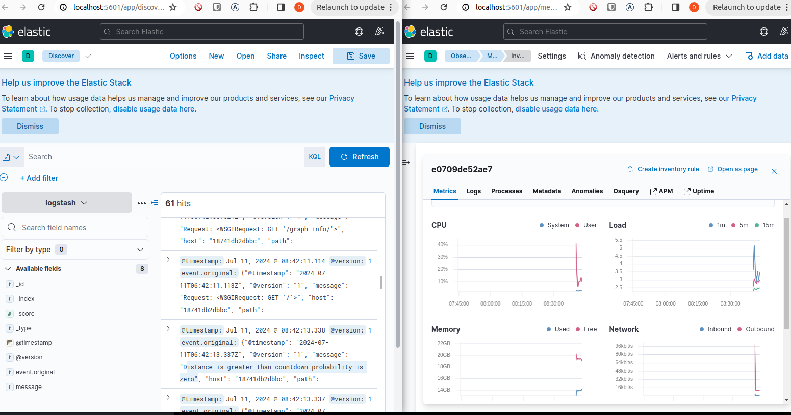

# Falcon


### How to run the application (with monitoring) *recomended*
```
  $ docker compose -f docker-compose-dev.yml up --no-deps --build --force-recreate
```
when the logs in the terminal show the following message, the application is ready to be used
```
frontend-1       |  INFO  Accepting connections at http://0.0.0.0:4200
```



### How to run the application (without monitoring)
```sh
  $ docker compose up --build --force-recreate
```

## Set up for development
### Setup backend
[Link readme backend](./falcon_backend/readme.md)

### Setup frontend
[Link readme frontend](./falcon_frontend/readme.md)
